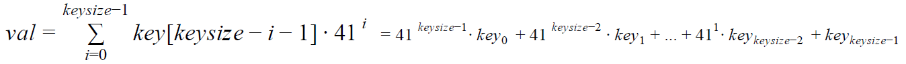

# Project 3: hashing

CPSC 335 - Algorithm Engineering
Spring 2020

## Abstract

In this project you will design, implement, and analyze one algorithm for the hashing problem. The algorithm
is called Cuckoo Hashing, presented in class, and detailed ​here​. For this problem, you will design and
implement one algorithm in C++, test it on various inputs and complete a hash table with a given input. No
algorithm analysis is needed for this project.

## The Cuckoo Hashing Algorithm

There are several versions of cuckoo hashing. The version we learned in class is the simplest, where there are
two hash functions, and thus only two places where any given item could be stored in the table. Let us
consider the set of keys to be printable ASCII strings of length no more than 80. Let us consider the hash
table size to be 17.

If key is the string representing the key, then let _keysize_ be the size of the string _key_ and _key_[_i_] be the
ASCII code of the (i+1)​th​ character in the string _key_ read from left to right:

### key = key 0 key 1 ... keykeysize − 1 

Let us consider two different hash functions, f​1 ​ and f​2​. Function f​1 ​computes a large number and then brings
the result into the proper range, which is _0_... _tablesize_ −1 , using the formulas below:

#### _f_1 = _val_ % _tablesize_ 
#### if _f_1 < 0 then _f_1 = _f_1 + tablesize

Function f2 ​ also computes a large number and then brings the result into the proper range, which is

0..._tablesize_ − 1 , using the formulas below:

#### _f_2 = _val_ % _tablesize_ 
#### if _f_2 < 0 then _f_2 = _f_2 + tablesize

Both functions f1 ​and f2​ compute first a large number then it brings the result into the proper range which is
0..._tablesize_ − 1. But we can bring the intermediate results into this range after each calculation, we do not
need to wait until we compute the final result. Also, we can ring the power term 41 _index_ into this range before
multiplying it with _key__index_

You need to insert the strings below (also given in the input file in6.txt) into the hash table provided next.
Please put an empty line at the end of the file.

Algorithm Engineering
California State University
Fullerton
College of Engineering and Computer Science
School of Computer Science
Greedy pattern
Monge properties
String matching
Matrix searching
Optimal tree construction
Online algorithms
emphasis on
Server Problem
Some related problem
Self-Stabilization
one of the greatest mysteries
in science
Quantum nature of universe
in physics
are known
Cuckoo Hashing is fun!

into the hash table (next page) using f1​ for the first table and f2​​ for the second table. Show the result of the
insertion in the table shown on the next page.

Hint​: consider a two-dimensional table of strings t, where t[0] is T1 and t[1] is T2. Consider a variable index
that oscillates between 0 and 1as it would have oscillated between T1 and T2. In C++, the value of index
could be changed using the tertiary operator: index = index? 0:1. Depending on the value of index, either
apply hash function f1​ (index == 0) or f2​ (index == 1).

## Obtaining and Submitting Code

This document explains how to obtain and submit your work:
GitHub Education / Tuffix Instructions
Here is the invitation link for this project:
https://classroom.github.com/g/KFBMp5Gn

## Implementation

You are provided with the following files.

1. cuckoo.cxx​ is is a C++ file that contains the functions and definitions needed for this project. The
    function definitions are incomplete skeletons; you will need to rewrite them to actually work properly.
2. in4.txt​ is a text file that you can use to match the output available in problem description. You can
    use this file to see whether your algorithm implementation is working correctly. See sample runs.
3. in5.txt​ is another text file that you can use to match the output available in problem description. You
    can use this file to see whether your algorithm implementation is working correctly. See sample runs.
4. in6.txt​ is a text file for which you need to complete the table required in problem description.
README.md​ contains a brief description of the project, and a place to write the names and CSUF email

## addresses of the group members. You need to modify this file to identify your group members.

## What to Do

Decide on who will be in your team, or decide to work alone; have one of your team members accept the
GitHub assignment by following the invitation link; have any other team members join your team by
following the invitation link; and add your group member names to ​README.md​.
Then, implement each of the two algorithms in C++ using the provided skeleton code from ​cuckoo.cxx​.
Test your code using the provided text files ​in4.txt​ and ​in5.txt​.
Once you are confident that your algorithm implementation is correct, complete the table and submit ​ **_in PDF_**

## Sample Runs for the Cuckoo Hashing Algorithm:

Example #1:
K:\202> cuckoo
CPSC 335-x – Programming Assignment #3: Cuckoo Hashing algorithm

Input the file name (no spaces)!
in4.txt

String &lt;Algorithm Engineering> will be placed at t[16][0]  
String &lt;California State University> will be placed at t[3][0]  
String &lt;Fullerton> will be placed at t[8][0]  
String &lt;College of Engineering & Computer Science> will be placed at t[2][0]
String &lt;School of Computer Science> will be placed at t[3][0] replacing &lt;California State University>  
String &lt;California State University> will be placed at t[11][1]  
String &lt;Greedy pattern> will be placed at t[4][0]  
String &lt;Divide-and-Conquer> will be placed at t[1][0]  
String &lt;Monge Properties> will be placed at t[0][0]  
String &lt;String Matching> will be placed at t[0][0] replacing &lt;Monge Properties>
String &lt;Monge Properties> will be placed at t[7][1]  
String &lt;Matrix Searching> will be placed at t[9][0]  
String &lt;Optimal Tree Construction> will be placed at t[5][0]

Example #2:
K:\202> cuckoo
CPSC 335-x – Programming Assignment #3: Cuckoo Hashing algorithm

Input the file name (no spaces)!
in5.txt

String &lt;Algorithm Engineering> will be placed at t[16][0]  
String &lt;California State University> will be placed at t[3][0]  
String &lt;Fullerton> will be placed at t[8][0]  
String &lt;College of Engineering and Computer Science> will be placed at t[15][0]
String &lt;Greedy pattern> will be placed at t[4][0]  
String &lt;Divide-and-Conquer> will be placed at t[1][0]  
String &lt;Monge Properties> will be placed at t[0][0]  
String &lt;String Matching> will be placed at t[0][0] replacing &lt;Monge Properties>
String &lt;Monge Properties> will be placed at t[7][1]  
String &lt;Matrix Searching> will be placed at t[9][0]  
String &lt;Optimal Tree Construction> will be placed at t[5][0]  
String &lt;Online algorithm> will be placed at t[14][0]  
String &lt;Offline algorithm> will be placed at t[14][0] replacing &lt;Online algorithm>
String &lt;Online algorithm> will be placed at t[12][1]  
String &lt;emphasis on> will be placed at t[6][0]  
String &lt;Server Problem> will be placed at t[10][0]  
String &lt;Some related problem> will be placed at t[4][0] replacing &lt;Greedy pattern>  
String &lt;Greedy pattern> will be placed at t[10][1]  
String &lt;Self-Stabilization> will be placed at t[16][0] replacing &lt;Algorithm Engineering>  
String &lt;Algorithm Engineering> will be placed at t[3][1]  
String &lt;One of the greatest> will be placed at t[13][0]

